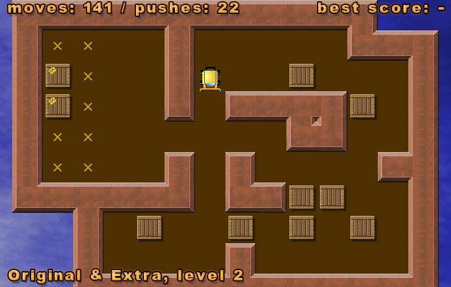
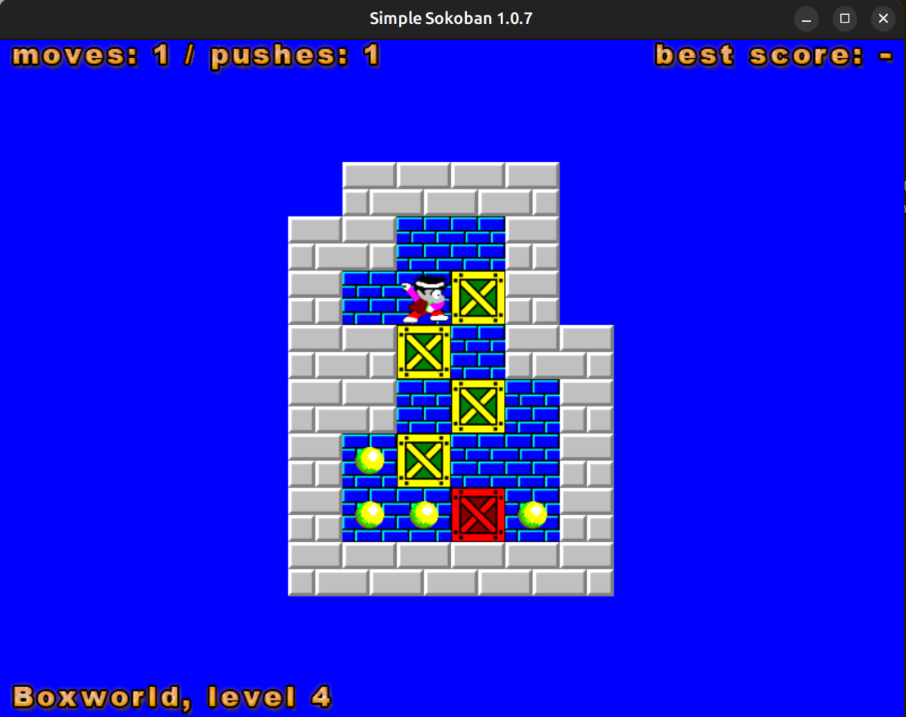

## ⚠️ IMPORTANT NOTICE

**This repository is NOT the official Simple Sokoban repository.**

This is a modified fork of Simple Sokoban version 1.0.7 that has been updated to:

* **Compile on modern Linux systems** (tested on Ubuntu 24.04)
* **Support Wayland** display server with proper video driver configuration
* **Include standalone packaging** for easy distribution (`make standalone`)
* **Enhanced documentation** with build instructions, Wayland troubleshooting, and packaging guides

These modifications were made using AI assistance to improve compatibility with modern Linux distributions and development workflows.

**For the official, unmodified source code**, please visit:
* **Official Website**: https://mateusz.fr/simplesok/
* **Official Source Code**: `svn://svn.mateusz.fr/simplesok`

All credit for Simple Sokoban goes to the original author, Mateusz Viste (Copyright © 2014-2025).

<br><br><br><br><br><br><br><br><br><br>


# Simple Sokoban

Copyright © 2014-2025 Mateusz Viste



Simple Sokoban is a Sokoban game aimed at playability and portability across systems. It is written in ANSI C89, using SDL2 for user interactions. I developed it primarily for Linux, but it should compile and work just fine on virtually anything that has a C compiler and supports SDL2.

## Features

* Animated movements
* Unlimited level solutions
* Unlimited undos
* 3 embedded level sets
* Support for external *.xsb levels
* Support for levels of size up to 62x62
* Copying levels to clipboard
* Save/load
* Configurable skins (see also: [skin format](https://mateusz.fr/simplesok/skinfmt/))
* ...

## Download

* [Simple Sokoban ver 1.0.7 (sources)](https://mateusz.fr/simplesok/)
* [Simple Sokoban ver 1.0.2 (Windows x64 build)](https://mateusz.fr/simplesok/)

For easy gaming on Linux, Simple Sokoban is available as a FlatPak app on [Flathub](https://flathub.org/apps/io.osdn.simplesok).

Native RPM and DEB packages for a few Linux distributions can be found on the [openSUSE Software platform](https://software.opensuse.org/package/simplesok).

Better Debian/Devuan packages are kindly provided by Friedhelm Mehnert.

Old versions may be downloaded [HERE](https://mateusz.fr/simplesok/).

### Source Code VCS

```bash
svn co svn://svn.mateusz.fr/simplesok
```

## Building from Source

### Build Requirements (Ubuntu 24.04)

```bash
sudo apt install -y \
  build-essential \
  autoconf \
  automake \
  libtool \
  pkg-config \
  libsdl2-dev \
  libsdl2-image-dev \
  zlib1g-dev \
  libcurl4-openssl-dev
```

### Build Steps

```bash
cd simplesok-1.0.7
autoreconf -fi
./configure
make
./simplesok
```

For more build options, see [simplesok.txt](simplesok.txt).

## Running Simple Sokoban

### Basic Usage

```bash
./simplesok
```

## Adding Custom Skins

For complete documentation on adding and using custom skins, see [SKINS.md](SKINS.md).

**Quick reference:**
- Skins are PNG or BMP image files with 4-column sprite maps
- Place skins in: `~/.local/share/simplesok/skins/` (recommended)
- Use with: `./simplesok --skin=skinname`
- List skins: `./simplesok --skinlist`
- Format details: https://mateusz.fr/simplesok/skinfmt/

## Packaging

For information on building different package formats (RPM, DEB, Flatpak, standalone), see [PACKAGING.md](PACKAGING.md).

## From the same author...

If you enjoyed Simple Sokoban, then perhaps you will also appreciate these other games I have made:

* [Atomiks](https://mateusz.fr/atomiks/)
* [Dr. Mind](https://mateusz.fr/drmind/) (DOS only)
* [OpenKropki](https://mateusz.fr/openkropki/)

## License

Simple Sokoban is published under the terms of the MIT license. Licensing rules of skin files may differ (GPL, CC, ...).

## Links

* **Official Website**: https://mateusz.fr/simplesok/
* **Skin Format Documentation**: https://mateusz.fr/simplesok/skinfmt/
* **Source Code**: `svn://svn.mateusz.fr/simplesok`

<br><br><br><br><br><br><br><br><br><br>


# Simplesok-Revised

## Version
This revision is version 1.0.8, built upon the original Simple Sokoban v1.0.7.




## License

Simplesok-Revised is published under the terms of the MIT license. Licensing rules of skin files may differ (GPL, CC, ...).


## Video Driver Options

Simple Sokoban uses SDL2 for graphics. On systems with multiple display servers (X11, Wayland), you may need to specify which video driver to use.

**Wayland** (Recommended for modern Linux systems):
```bash
SDL_VIDEODRIVER=wayland ./simplesok
```

**X11 / XWayland** (For X11-based systems or compatibility):
```bash
SDL_VIDEODRIVER=x11 ./simplesok
```

**Auto-detect** (Default - SDL2 will try to detect automatically):
```bash
./simplesok
```

**Note**: If you get GLX errors on Wayland systems, use:
```bash
SDL_VIDEODRIVER=wayland ./simplesok
```

Adding to GNOME Main Menu:
```bash
bash -c "SDL_VIDEODRIVER=wayland /opt/games/simplesok/simplesok"
```

To make the video driver setting permanent, add to your `~/.bashrc`:
```bash
export SDL_VIDEODRIVER=wayland
```


